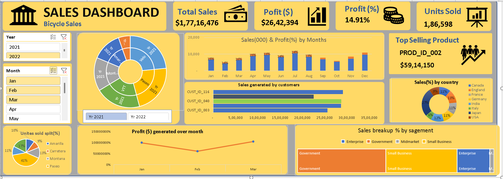

# 🚴‍♂️ Interactive Bicycle Sales Dashboard 📊

Welcome to the **Interactive Bicycle Sales Dashboard** project! This repository showcases an Excel-based dashboard designed to analyze and visualize key insights from bicycle sales data. The project demonstrates the power of data analysis and visualization in decision-making.

---

## 🎯 **Project Objective**
To analyze bicycle sales data and create an interactive dashboard that provides meaningful insights into sales performance and trends.

---

## 📊 **Key Features**

- **Total Sales:** Displays the overall revenue generated from sales.
- **Sales Percentage Contribution:** Highlights the share of each product or region in total sales.
- **Profit Analysis:** Shows the profitability of different products and regions.
- **Units Sold:** Provides insights into the volume of products sold.
- **Sales by Country:** Breaks down sales figures by country for regional performance analysis.
- **Sales by Month and Year:** Identifies seasonal trends and yearly performance.
- **Top-Selling Products:** Lists the most popular products based on sales data.

---

## 🛠️ **Tools and Techniques Used**

- **Microsoft Excel**
  - Data Cleaning and Transformation
  - Advanced Functions (e.g., SUM, COUNTIF, PIVOT Tables)
  - Conditional Formatting
  - Charts and Graphs
- **Data Visualization:** To make the dashboard interactive and visually engaging.

---


---

## 📷 **Dashboard Preview**



---

## 🚀 **How to Use**

1. Clone this repository to your local machine:
   ```bash
   git clone https://github.com/your-username/bicycle-sales-dashboard.git
   ```

2. Open the Excel file in the repository.

3. Interact with the dashboard by using the slicers and filters to explore the data.

---

## 🙌 **What I Learned**

- Enhanced Excel skills, including data cleaning, advanced functions, and visualization.
- Effective ways to present complex data insights in a clear and engaging manner.
- Gained deeper insights into sales trends and performance metrics.

---


## 📬 **Contact**

If you have any questions or feedback, please reach out to me:
- LinkedIn: [Your LinkedIn Profile](https://www.linkedin.com/in/sshankt/)
- Email: [Your Email Address](shashank.corpconnect@gmail.com)

---

### 📌 **Acknowledgment**

Thanks to the data analysis community for inspiring this project. Let’s keep learning and growing!
